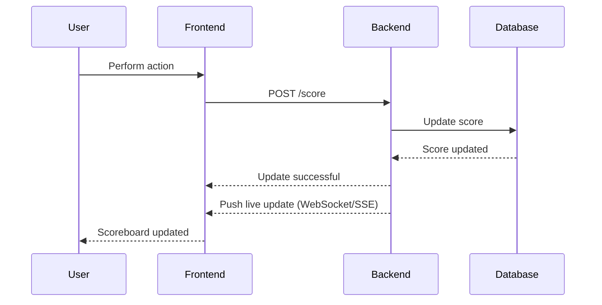

# Problem 6: Architecture

## Task

Write the specification for a software module on the API service (backend application server).

### Software Requirements

1. We have a website with a scoreboard, which shows the top 10 user’s scores.
2. We want live updates of the scoreboard.
3. Users can perform an action (the specifics of the action are not important), and completing this action will increase the user’s score.
4. Upon completion, the action will dispatch an API call to the application server to update the score.
5. We want to prevent malicious users from increasing scores without authorization.

## Module Specification

### API Endpoints

1. **GET /scores**
    - Description: Fetch the top 10 user scores.
    - Response: JSON array of user scores.

2. **POST /score**
    - Description: Update the score for a user.
    - Request Body: JSON object containing user ID and score increment.
    - Response: Status of the update operation.

### Authentication and Authorization

- Use JWT (JSON Web Tokens) for user authentication.
- Ensure that the user is authenticated before allowing score updates.

### Data Validation

- Validate the user ID and score increment in the request body.
- Ensure that the score increment is a positive integer.

### Rate Limiting

- Implement rate limiting to prevent abuse of the score update endpoint.
- Limit the number of score update requests per user per minute.

### Real-time Updates

- Use WebSockets or Server-Sent Events (SSE) to push live updates to the scoreboard.

### Security Measures

- Sanitize all inputs to prevent SQL injection and other attacks.
- Use HTTPS to encrypt data in transit.
- Implement logging and monitoring to detect and respond to suspicious activities.

## Diagram

## Additional Comments

- Consider implementing a caching layer (e.g., Redis) to store the top 10 scores for faster retrieval.
- Ensure that the system is scalable to handle a large number of concurrent users.
- Regularly review and update security measures to protect against new threats.
