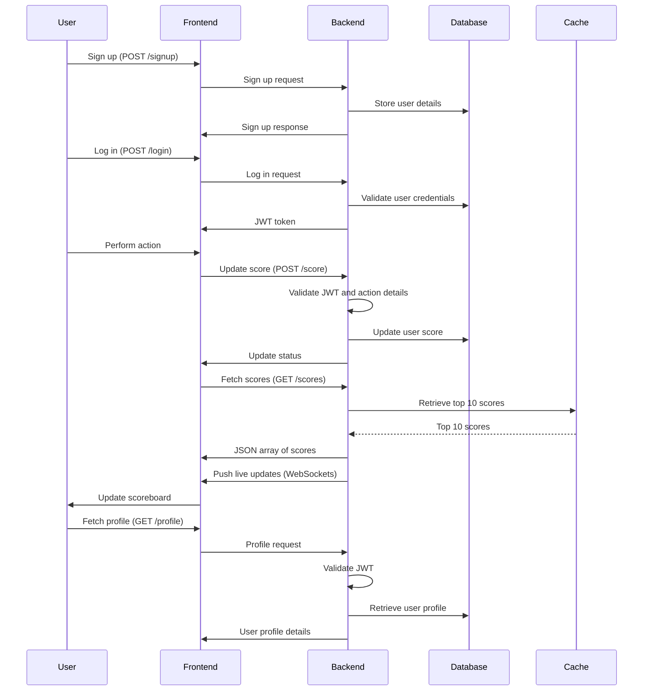

# Problem 6: Architecture

### Software Requirements

1. We have a website with a scoreboard, which shows the top 10 user’s scores.
2. We want live updates of the scoreboard.
3. Users can perform an action (the specifics of the action are not important), and completing this action will increase the user’s score.
4. Upon completion, the action will dispatch an API call to the application server to update the score.
5. We want to prevent malicious users from increasing scores without authorization.

## Module Specification

### API Endpoints

1. **GET /scores**
    - Description: Fetch the top 10 user scores.
    - Response: JSON array of user scores.

2. **POST /score**
    - Description: Update the score for a user.
    - Request Body: JSON object containing the action details.
    - Headers: JWT token for user authentication.
    - Response: Status of the update operation.
    - Note: The user ID should be extracted from the JWT token in the header. The score increment should be calculated in the backend based on the action details to prevent abuse of the API.

3. **POST /signup**
    - Description: Register a new user.
    - Request Body: JSON object containing user details (e.g., username, password).
    - Response: Status of the signup operation.

4. **POST /login**
    - Description: Authenticate a user and return a JWT token.
    - Request Body: JSON object containing username and password.
    - Response: JSON object containing the JWT token.

5. **GET /profile**
    - Description: Fetch the profile details of the authenticated user.
    - Headers: JWT token for user authentication.
    - Response: JSON object containing user profile details.

### Authentication and Authorization

- Use JWT (JSON Web Tokens) for user authentication.
- Ensure that the user is authenticated before allowing score updates.

### Data Validation

- Validate the action details in the request body of the **POST /score** endpoint.
- Ensure that the score increment is calculated in the backend based on the action details to prevent manipulation.
- Extract and validate the user ID from the JWT token in the request headers.
- Ensure that all user inputs are sanitized to prevent SQL injection and other attacks.
- Validate user details in the **POST /signup** and **POST /login** endpoints to ensure they meet the required format and constraints.
- Validate the JWT token in the **GET /profile** and **POST /score** endpoints to ensure the user is authenticated.

### Rate Limiting

- Implement rate limiting to prevent abuse of the score update endpoint.
- Limit the number of score update requests per user per minute.
- Use a library like `express-rate-limit` to enforce rate limiting on the backend.
- Monitor and log rate limit violations for further analysis.
- Notify users when they exceed the rate limit to ensure transparency.

### Real-time Updates

- Use WebSockets to push live updates to the scoreboard.
- Handle reconnections gracefully to maintain a seamless user experience.
- Optimize the frequency of updates to balance real-time performance and server load.

### Security Measures

- Sanitize all inputs to prevent SQL injection and other attacks.
- Use HTTPS to encrypt data in transit.
- Implement logging and monitoring to detect and respond to suspicious activities.

### Suggested Tech Stack

- **Frontend:** React.js for building the user interface.
- **Backend:** Node.js with Express.js for handling API requests.
- **Database:** PostgreSQL for storing user scores.
- **Authentication:** JSON Web Tokens (JWT) for secure user authentication.
- **Real-time Communication:** WebSockets for live updates.
- **Caching:** Redis for caching the top 10 scores.
- **Security:** HTTPS, input sanitization, and monitoring tools like Sentry.

### Flow of Execution

1. **User Registration and Authentication**
    - User signs up using the **POST /signup** endpoint.
    - User logs in using the **POST /login** endpoint and receives a JWT token.

2. **Score Update Process**
    - User performs an action on the frontend.
    - The action triggers an API call to **POST /score** with the JWT token in the headers.
    - The backend validates the JWT token and action details.
    - The backend calculates the score increment and updates the user's score in the database.
    - The backend responds with the status of the update operation.

3. **Fetching Scores**
    - The frontend fetches the top 10 scores using the **GET /scores** endpoint.
    - The backend retrieves the scores from the database or cache and responds with a JSON array of user scores.

4. **Real-time Scoreboard Updates**
    - The backend pushes live updates to the scoreboard using WebSockets.
    - The frontend listens for WebSocket messages and updates the scoreboard in real-time.

5. **Profile Management**
    - User fetches their profile details using the **GET /profile** endpoint with the JWT token in the headers.
    - The backend validates the JWT token and responds with the user's profile details.

## Additional Comments

- Consider implementing a caching layer (e.g., Redis) to store the top 10 scores for faster retrieval.
- Ensure that the system is scalable to handle a large number of concurrent users.
- Regularly review and update security measures to protect against new threats.

